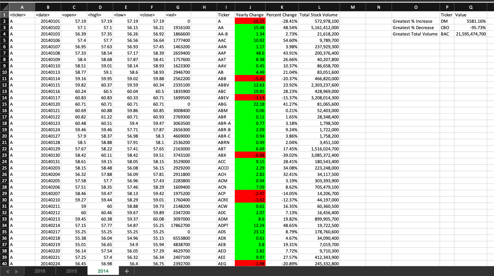
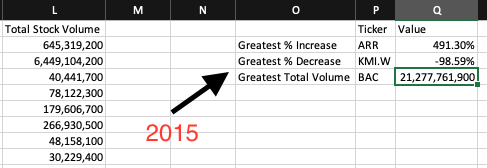

# VBA Homework: The VBA of Wall Street - Prajesh Patel #

## Background
You are well on your way to becoming a programmer and Excel master! In this homework assignment, you will use VBA scripting to analyze real stock market data. Depending on your comfort level with VBA, you may choose to challenge yourself with a few of the challenge tasks.

## Requirement
1. Create a new repository for this project called VBA-challenge. Do not add this homework to an existing repository.
2. Inside the new repository that you just created, add any VBA files you use for this assignment. These will be the main scripts to run for each analysis.

### Stock Market Analyst

## Steps

* Beginning Steps of the writing Macro:
	* Define the column headers labels
	* Declare or Set the Initial Variables for all dimensions.

* Determine the Last Row of the worksheet. This will help to calculate the total stock volume.

* Wrote a script to loop through all the stock
	* The total volume of the stocks
	* Yearly Change difference between the stock opened at the beginning and stock closed at the end of the year.
	* The percent change between opening of the year and what it closed.
	* Applied conditional formatting that highlights positive change in green and negative change in red.

Below are the screenshots of the result after running the macro:

# 2014 #

# 2015 #

# 2016 #

# Bonus #
* "Greatest % increase", "Greatest % decrease" and "Greatest total volume".
	* I used column I and column J. I found the Ticker which had highest increase and lowest decrease between all tickers.
	* I used results between column I and column L. I created script which found the highest / Greatest total from all of the tickers. 

# Bonus 2014 #

# Bonus 2015 #

# Bonus 2016 #

